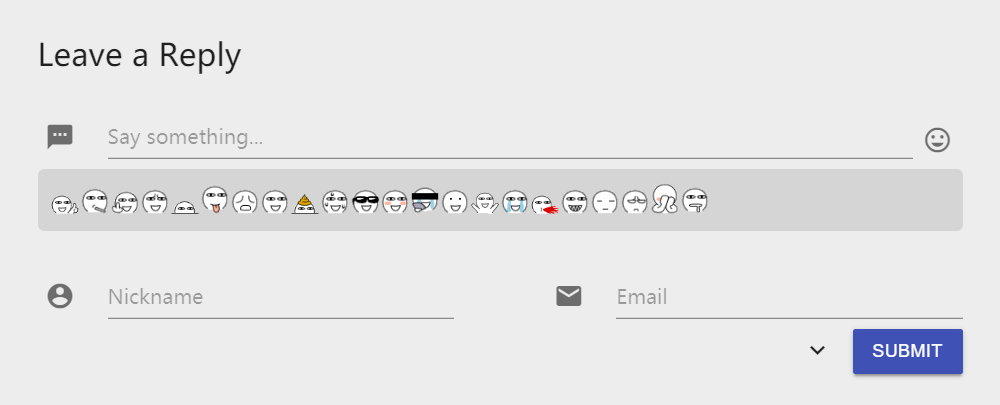

# Emoji in Comments

MDx provides a emoji-in-comment switch in the theme settings to enable customized emoji support, but the a plug-in called Alu from mayuko still needs to be installed to active the function. Click [here](https://doc.flyhigher.top/mdx/resources/alu.zip) to download modified Alu that designed for MDx.

!!! bug "Misplaced emoji button"
    It is known that the emoji buttonin comment block is slightly misplaced (does not affect use) when the user is logged in. Since MDx does not include multi-user support, this problem may not be fixed right now.
    