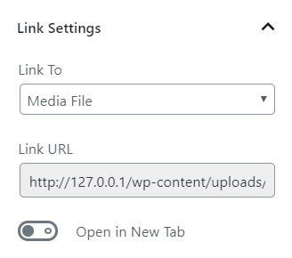

# ImgBox

ImgBox, or the "light box", is a built-in function. MDx has a simple ImgBox, which can be enabled only by opening relevant options in the theme settings.

ImgBox does not apply to every picture in the article, **but only works on pictures wrapped in links to themselves.** To do so, you just need to set "Linked To" attribute to "Media File" while inserting the picture.

!!! tip "Other light box plug-ins"
    With ImgBox is enabled, ImgBox may conflict with other light box plug-ins. To use them, you need to disable the built-in ImgBox first.
