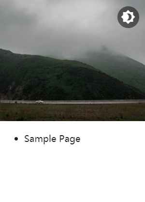
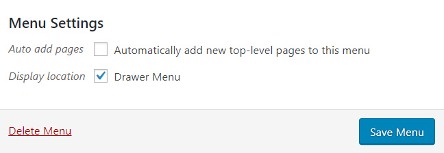
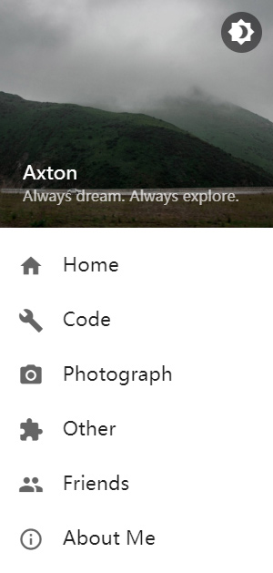
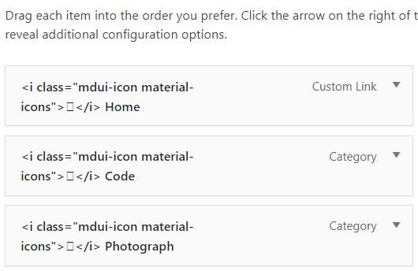

# Config Menu

本页面会指导你激活菜单并向菜单中添加图标。

!!! info "图标来源"
    MDx 支持的图标来自于 Google。

## 激活菜单

当主题被激活后，你可能会发现抽屉菜单中的菜单样式与预期不符。可能像这样：



不要担心，只需简单的设置即可使其恢复正常：打开后台设置项中的「外观」-「菜单」 ，新建一个菜单或选择原有菜单，并在菜单的「显示位置」中勾选「抽屉菜单」，保存即可。



!!! question "找不到「抽屉菜单」复选框？"
    你必须已有菜单或先新建菜单才能勾选「抽屉菜单」。

!!! info "菜单深度"
    MDx 仅支持显示 2 级菜单，更深层级的菜单会被忽略。

## 向菜单中添加图标

你可能希望向菜单中添加图标，就像这样：



要在菜单中添加图标，你需要修改你的菜单设置。首先从 [MDUI 图标库](https://www.mdui.org/docs/material_icon) 中找到你想要的图标，并点击它，复制任意一段由页面提供的代码。这段代码应该像这样：

``` html
<i class="mdui-icon material-icons">home</i>
```

随后，在菜单设置中，把这段代码粘贴在菜单项的名称之前，并在代码与原名称之间添加一个空格。就像这样：



最后，如果需要的话，对其余菜单项也进行相同的处理。
