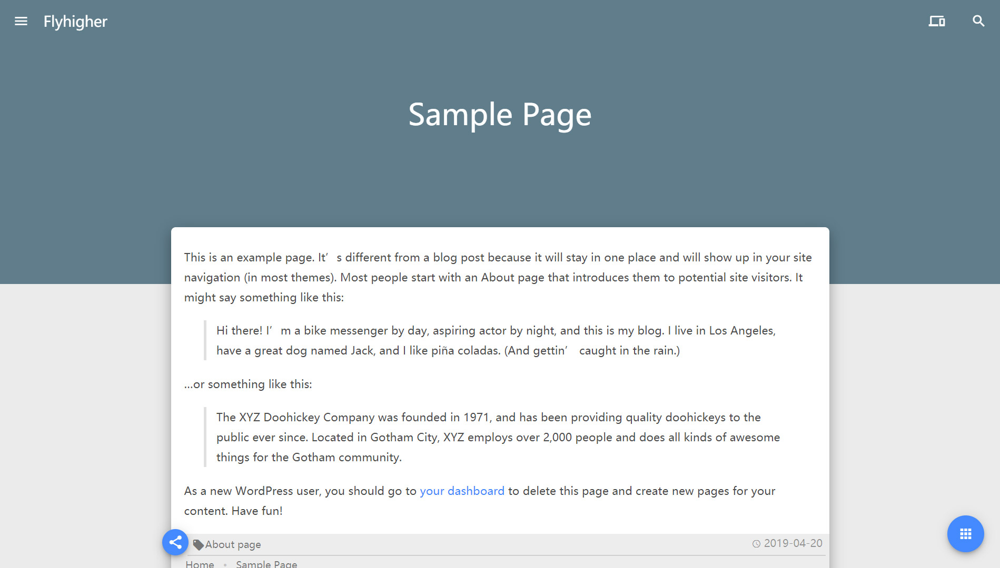
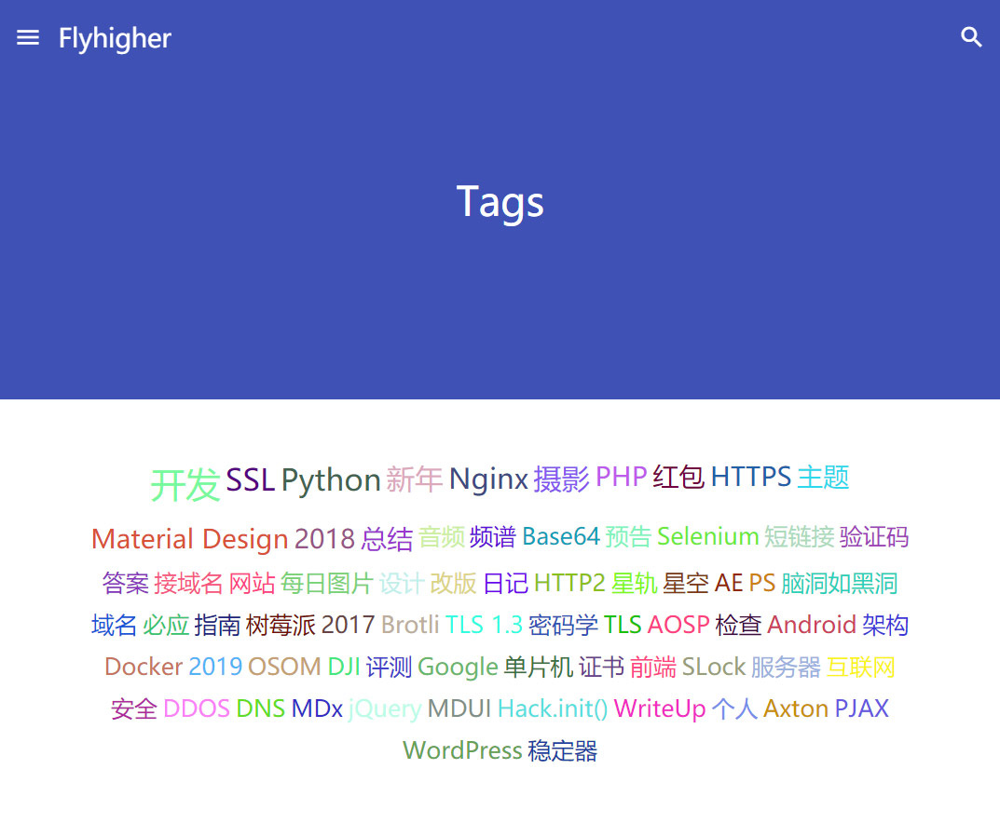

# Page Templates

MDx 提供 3 个页面模板。你可以在「编辑页面」-「页面属性」选项卡中的「模板」选项中更改页面的模板。本页面的剩余内容描述了不同页面的用途。

## PostLike

此模板提供了类似于文章的页面样式。使用此模板可以使页面看起来像常规文章。

## Links

此模板用于「链接」功能，详细可参阅 [友情链接](links.md)。

## Tags

此模板可以展示标签云。使用此模板可以在相应页面中显示当前的标签云。

