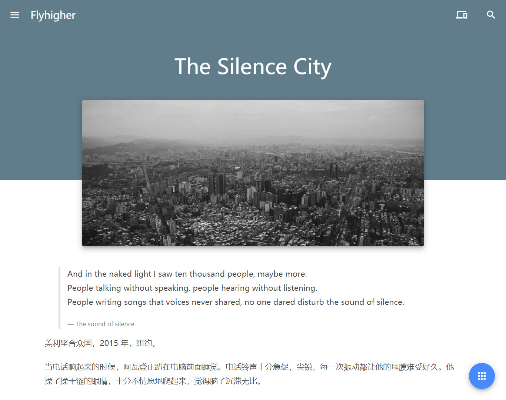
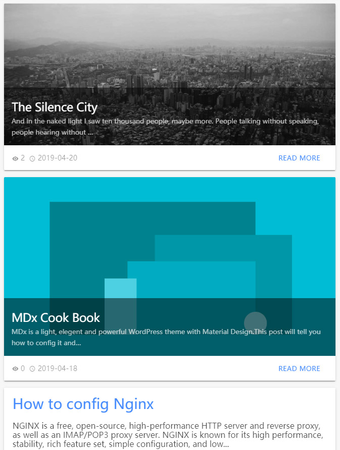
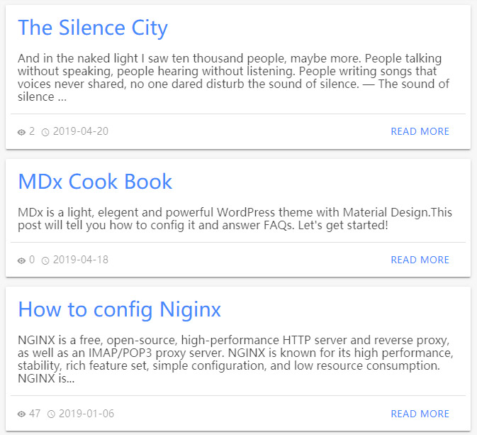
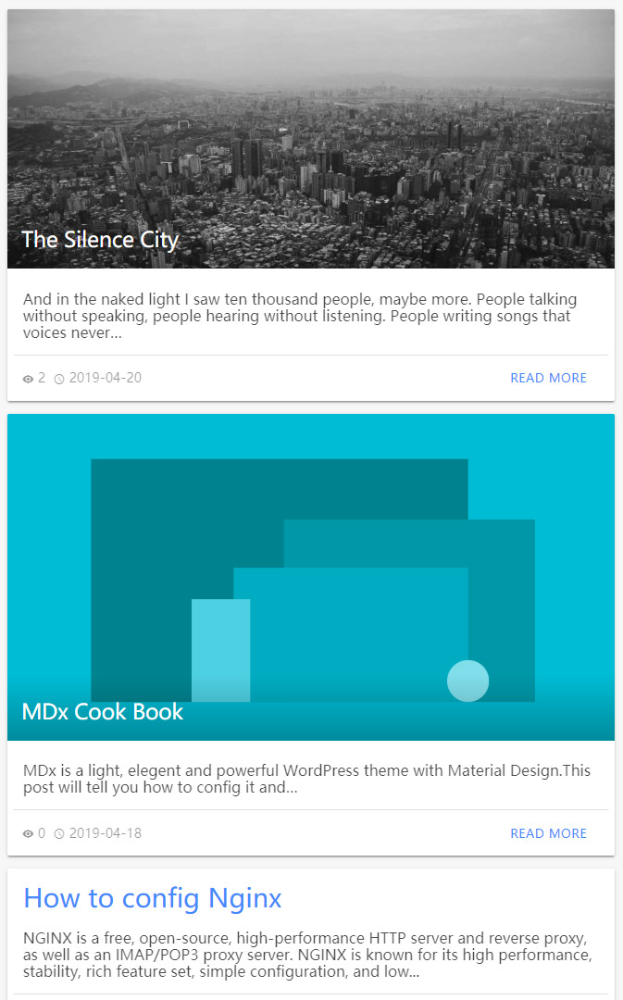
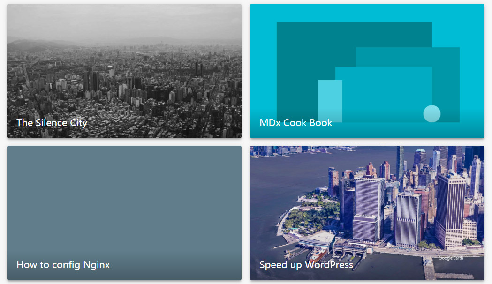

# Styles

MDx 提供了 2 种首页样式、3 种文章页样式、4 种文章列表样式。在后台「MDx 主题」-「样式」中可以切换这些样式。

!!! info "更多样式"
    随着 MDx 的更新，MDx 可能会增加更多的样式选择。

## 首页样式

首页样式决定了首页的样式。MDx 提供「默认」和「简单」2 种样式。

默认：

简单：

## 文章页样式

文章页样式决定了文章页面的样式。MDx 提供了「标准」「简洁」和「通透」3 种样式。

标准：

简洁：

通透：

## 文章列表样式

文章列表样式决定了首页、归档页等页面中文章列表的样式。MDx 提供了「简洁」「列表」「干净」和「网格」4 种文章列表样式。

简洁：

列表：

干净：

网格：

