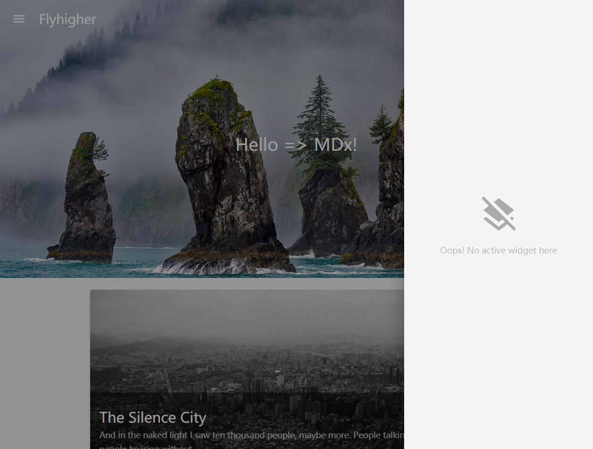
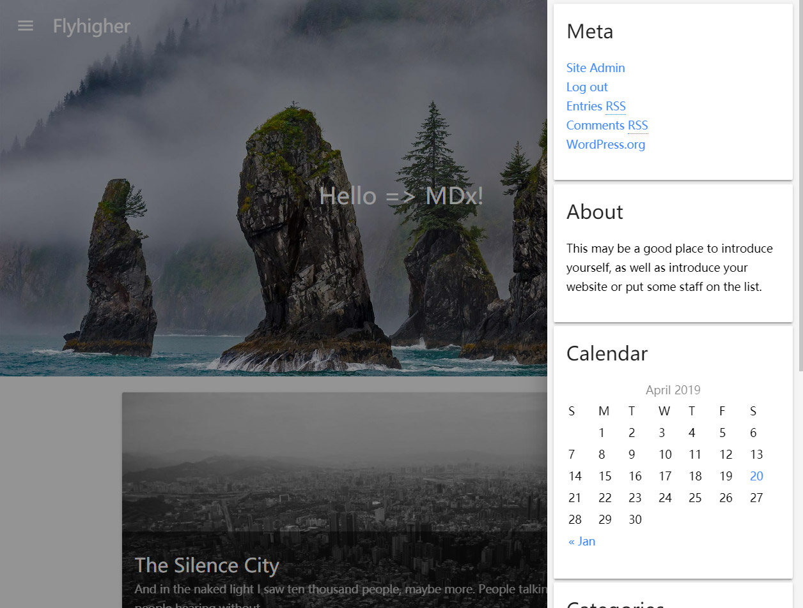

# Widgets

MDx 支持 WordPress 小工具，但默认关闭。要启用小工具支持，你需要在后台「MDx 主题」-「功能」中打开「右侧小工具栏」。

启用后，你可以在每个页面右下角看到小工具栏按钮。小工具栏可以通过点击按钮或从页面右侧向中心滑动（触摸）的方式调出。

现在你的小工具栏还是空的。你可以在后台「外观」-「小工具」中管理你的小工具。将小工具添加到「右侧菜单」栏目即可使小工具在右侧小工具栏中显示。

