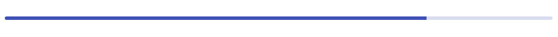

# Progress Bar

MDx 提供了多种短代码的支持，在文章中插入短代码即可调用相关功能。「进度指示器」是其中的一种。

## 基本用法

```
[mdx_progress]进度[/mdx_progress]
```
## 进度内容

你可以用 0-100 数字表示进度，支持小数。

## 例子

```
[mdx_progress]17.57[/mdx_progress]
```

## 预览


