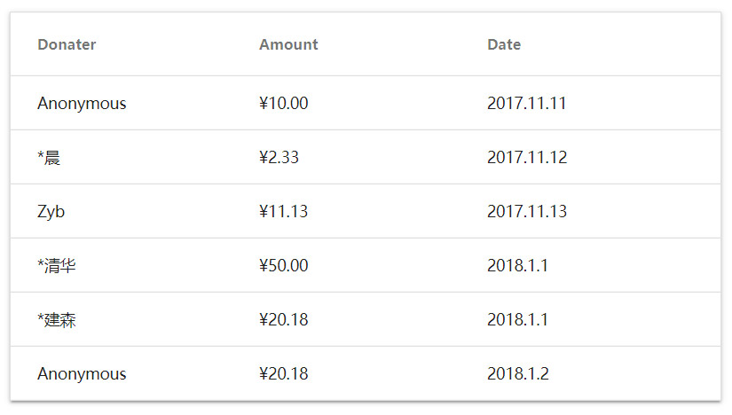

# Table

MDx 提供了多种短代码的支持，在文章中插入短代码即可调用相关功能。「表格」是其中的一种。

## 基本用法

```
[mdx_table 属性名="属性值"]表格内容[/mdx_table]
```
## 可用属性

| 属性名 | 可选值 | 默认值 | 描述 |
| ------------ | ------------- | ------------ | ------------ |
| header | `true`/`false` | `false` | 指定表格是否有表头，值为 `true` 则表格第一行将作为表头 |
| hover | `true`/`false` | `true` | 控制表格是否响应鼠标悬停，值为 `true` 则表格内容行会响应鼠标悬浮状态 |

## 表格内容

- 换行表示结束一个单元格，最后一个单元格不需要额外换行。

- `-----` 单独一行表示结束一个行，最后一行不需要结束行。

## 例子

```
[mdx_table header="true"]捐助者
金额
日期
-----
微信匿名
¥10.00
2017.11.11
-----
*晨
¥2.33
2017.11.12
-----
Zyb
¥11.13
2017.11.13
-----
*清华
¥50.00
2018.1.1[/mdx_table]
```

!!! tip "技巧"
    属性都不是必须的，当没有指定属性值时将使用默认值。属性的顺序也不影响最终效果。

## 预览


