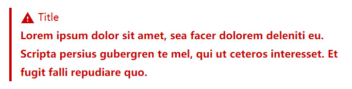

# Warning

MDx 提供了多种短代码的支持，在文章中插入短代码即可调用相关功能。「警告内容」是其中的一种。

## 基本用法

```
[mdx_warning 属性名="属性值"]警告内容[/mdx_warning]
```
## 可用属性

| 属性名 | 可选值 | 默认值 | 描述 |
| ------------ | ------------- | ------------ | ------------ |
| title | 任意字符串 | “警告” | 警告内容的标题 |

## 例子

```
[mdx_warning title="这里是标题"]这里是警告内容[/mdx_warning]
```

!!! tip "技巧"
    属性不是必须的，当没有指定属性值时将使用默认值。属性的顺序也不影响最终效果。

## 预览


