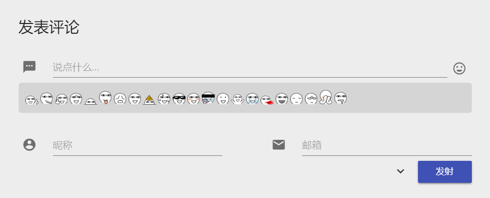

# 评论表情

MDx 在后台设置中提供了评论表情开关，但开启评论表情功能后仍需安装来自 mayuko 的 Alu 表情插件才能正常显示。请 [点此](https://mdxdoc.flyhigher.top/alu.zip) 下载适用于 MDx 的修改版插件。

!!! bug "评论表情按钮错位"
    目前已知评论表情按钮在用户已登录状态下会略微错位（不影响使用）。由于 MDx 并没有加入多用户支持，因此此问题可能在短时间内不会修复。
    