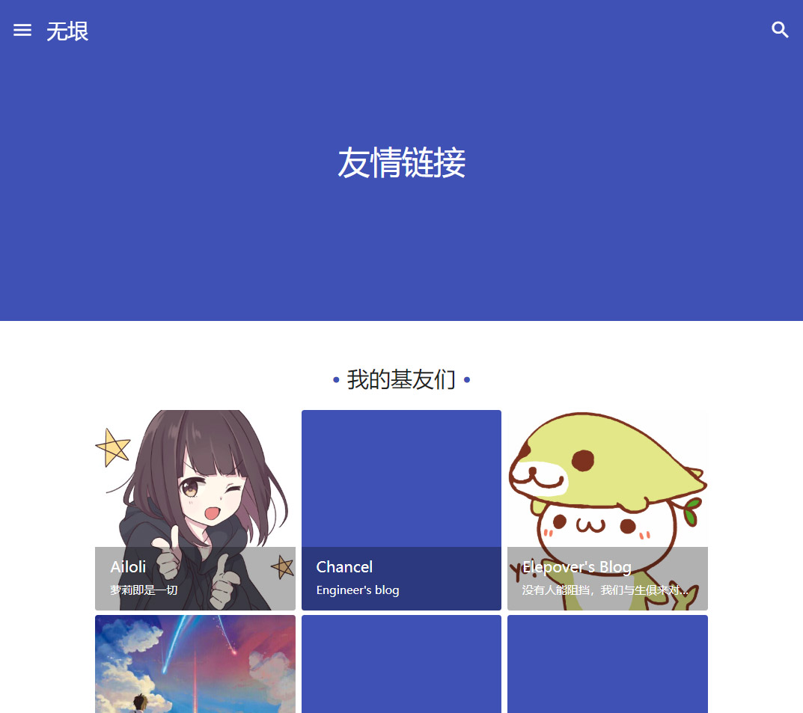

# 友情链接

MDx 支持 WordPress 「链接」功能，并以此实现了「友情链接」页面。本页面会指导你配置你的友情链接页面。

## 添加链接

前往后台「链接」栏目。如果你还没有没有链接分类目录的话，新建一个。

!!! note "链接分类目录名称"
    链接分类目录的名称将会被显示在最终的页面上，其他内容则不会。

然后，添加链接。「名称」和「Web 地址」为必填项。如果这个链接有简短描述或标语的话，将它填在「图像描述」处。

!!! tip "链接图像"
    如果这个链接有图像的话，你可以将图片 URL 填写在「添加链接」页面「高级」选项卡下的「图像地址」中。如果此空不为空，MDx 会将图片显示出来。

## 添加「友情链接」页面

在添加好链接之后，你可以在后台「页面」栏目中新建一个页面。在新建页面时，你需要把「页面属性」选项卡中的「模板」一项改为 "Links"，其他设置则与常规页面一致。

!!! tip "页面内容"
    你可以不填写任何内容。如果有内容，这些内容最终会显示在链接列表之前。

最后，发布页面，你应该可以在这个页面上看到链接列表。此后所有添加的链接也会自动在此页面上显示。

