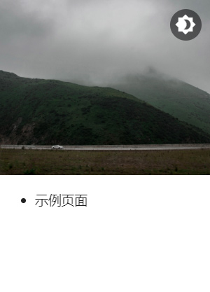
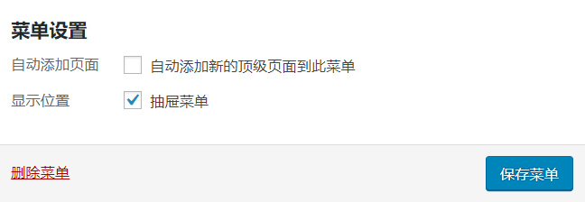
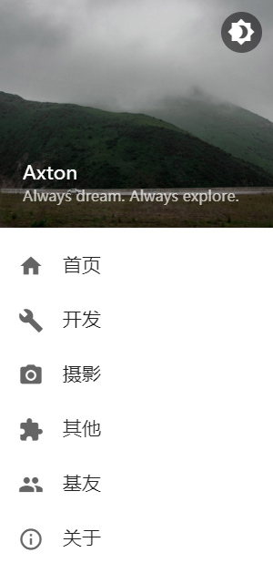
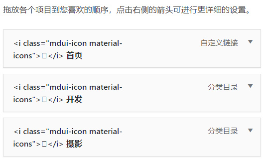

# 设置菜单

本页面会指导你激活菜单并向菜单中添加图标。

!!! info "图标来源"
    MDx 支持的图标来自于 Google。

## 激活菜单

当主题被激活后，你可能会发现抽屉菜单中的菜单样式与预期不符。可能像这样：



不要担心，只需简单的设置即可使其恢复正常：打开后台设置项中的「外观」-「菜单」 ，新建一个菜单或选择原有菜单，并在菜单的「显示位置」中勾选「抽屉菜单」，保存即可。



!!! question "找不到「抽屉菜单」复选框？"
    你必须已有菜单或先新建菜单才能勾选「抽屉菜单」。

!!! info "菜单深度"
    MDx 仅支持显示 2 级菜单，更深层级的菜单会被忽略。

## 向菜单中添加图标

你可能希望向菜单中添加图标，就像这样：



要在菜单中添加图标，你需要修改你的菜单设置。首先从 [MDUI 图标库](https://www.mdui.org/docs/material_icon) 中找到你想要的图标，并点击它，复制任意一段由页面提供的代码。这段代码应该像这样：

``` html
<i class="mdui-icon material-icons">home</i>
```

随后，在菜单设置中，把这段代码粘贴在菜单项的名称之前，并在代码与原名称之间添加一个空格。就像这样：



最后，如果需要的话，对其余菜单项也进行相同的处理。

## 向菜单中添加 Logo

除 MDUI 图标库中的图标外，MDx 添加了 17 个社交网站的 Logo 图标，你可以像使用普通图标一样将其添加到菜单中。

图标及对应代码如下：

QQ：

```html
<i class="mdui-color-theme mdx-sn-icon mdx_sn_qq"> </i>
```

微信：

```html
<i class="mdui-color-theme mdx-sn-icon mdx_sn_wechat"> </i>
```

微博：

```html
<i class="mdui-color-theme mdx-sn-icon mdx_sn_weibo"> </i>
```

知乎：

```html
<i class="mdui-color-theme mdx-sn-icon mdx_sn_zhihu"> </i>
```

哔哩哔哩：

```html
<i class="mdui-color-theme mdx-sn-icon mdx_sn_bilibili"> </i>
```

网易云音乐：

```html
<i class="mdui-color-theme mdx-sn-icon mdx_sn_neteasemusic"> </i>
```

酷安：

```html
<i class="mdui-color-theme mdx-sn-icon mdx_sn_coolapk"> </i>
```

豆瓣：

```html
<i class="mdui-color-theme mdx-sn-icon mdx_sn_douban"> </i>
```

GitHub:

```html
<i class="mdui-color-theme mdx-sn-icon mdx_sn_github"> </i>
```

Facebook:

```html
<i class="mdui-color-theme mdx-sn-icon mdx_sn_facebook"> </i>
```

Twitter:

```html
<i class="mdui-color-theme mdx-sn-icon mdx_sn_twitter"> </i>
```

Telegram:

```html
<i class="mdui-color-theme mdx-sn-icon mdx_sn_telegram"> </i>
```

Steam:

```html
<i class="mdui-color-theme mdx-sn-icon mdx_sn_steam"> </i>
```

WhatsApp:

```html
<i class="mdui-color-theme mdx-sn-icon mdx_sn_whatsapp"> </i>
```

Instagram:

```html
<i class="mdui-color-theme mdx-sn-icon mdx_sn_instagram"> </i>
```

Dribbble:

```html
<i class="mdui-color-theme mdx-sn-icon mdx_sn_dribbble"> </i>
```

Behance:

```html
<i class="mdui-color-theme mdx-sn-icon mdx_sn_behance"> </i>
```