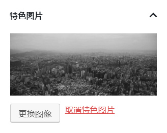

# 文章图像

MDx 使用 WorPress 的「特色图片」功能作为文章图像（文章头图）。如果没有指定特色图片，MDx 将不会显示「文章头图」——即使文章正文内有图片。

要设置特色图片，你可以在编辑文章页面中的「特色图片」选项卡中指定图片。

!!! question "找不到「特色图片」选项卡？"
    部分情况下，「特色图片」选项卡可能会被隐藏。你可以通过点击页面右上角的「显示选项」，并在展开的面板中勾选「特色图片」来激活此选项卡。
